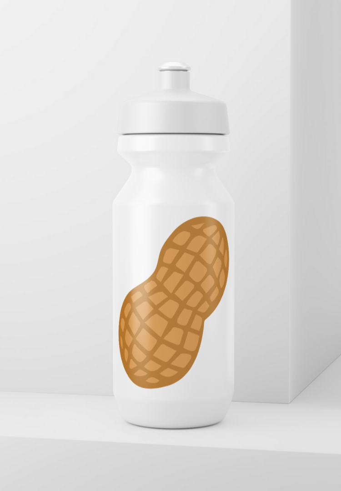

# Joke Website for Nuna's Nutmilk
Satirical ultra-luxury landing page for the world's most exclusive, hand-pressed nutmilk.


### Live Preview  
**https://nutmilk-dev.github.io/**

---

## About This Project

This is a static single-page site intended to parody high-end DTC (direct-to-consumer) product marketing. 
It features mock-luxury branding, tongue-in-cheek copywriting, and minimalist design inspired by premium food sites like Oatly and Blue Bottle—except the product is nut milk, and the satire is intentional. 
There is no build step. No frameworks. Just **HTML**, **CSS**, and a tiny bit of **vanilla JavaScript**.

---

## Getting Started (Local Dev)

This site is fully static. To preview it locally:

1. **Clone the repo**
   ```bash
   git clone https://github.com/nutmilk-dev/nutmilk-dev.github.io.git
   cd nutmilk-dev.github.io

2. ```bash
   npx serve
   python3 -m http.server
   open index.html
